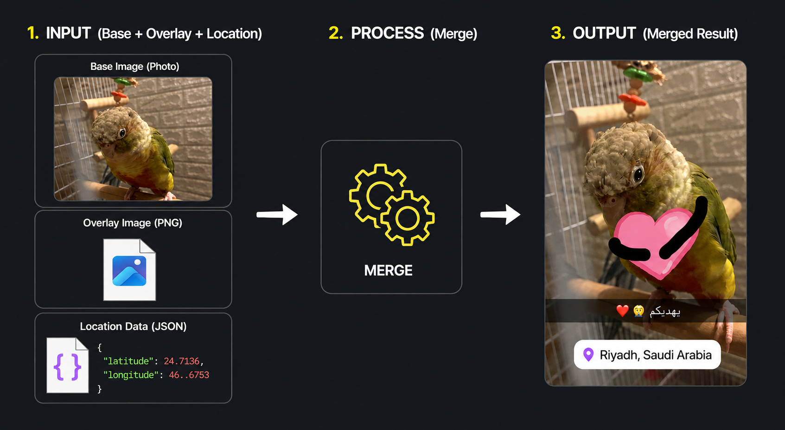

# Snapchat Memory Merger

A desktop GUI application to process, match, and merge exported Snapchat memories (overlays and base files) while preserving creation/modification timestamps and injecting GPS location data.




## Features

- **Overlay Merging:** Combines base photos (`Pillow`) and videos (`FFmpeg`) with their transparent overlays.
- **GPS Location Injection:** Timezone-aware matching of files to `memories_history.json` to inject GPS metadata.
- **Smart Directory Memory:** Remembers your input, output, and JSON directories.
- **Recursive Scan:** Batch process multiple Snapchat export folders recursively.
- **Metadata Preservation:** Retains original creation/modification timestamps.

## Prerequisites

- **Python 3.x**
- **FFmpeg** (Required for videos). Install quickly via:
  - **Windows:** `winget install ffmpeg` (Restart terminal/IDE after)
  - **macOS:** `brew install ffmpeg`
  - **Linux:** `sudo apt install ffmpeg`

## Installation & Usage

1. Install requirements:
   ```bash
   pip install -r requirements.txt
   ```
2. Run:
   ```bash
   python snap_merger.py
   ```
3. Select your input folder, customize options (Output folder & optional GPS JSON location), and click **Start Processing**.
