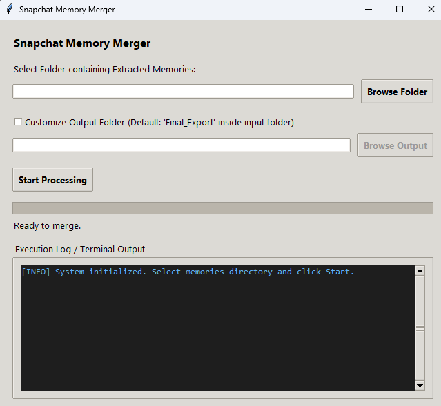

# Snapchat Memory Merger

A simple desktop GUI application built in Python to process and merge exported Snapchat memories. 

When you export memories from Snapchat, overlays (like text, drawings, and stickers) are often saved as separate transparent PNG files alongside their main images or videos. This tool merges these overlays back onto the main files (either images or videos) and saves them in a separate folder, all while preserving the original file metadata (creation, modification, and access times).



## Features

- **Automatic Pair Matching:** Automatically matches main images (`*-main.jpg`/`*.mp4`) with their overlay files (`*-overlay.png`).
- **Image Merging:** Combines base images and overlays using `Pillow` while preserving EXIF metadata.
- **Video Merging:** Overlays drawings and text on videos using `FFmpeg`.
- **Timestamp Preservation:** Retains file access, modification, and creation timestamps (Windows-specific using `pywin32`) from the original files on the merged results.
- **Graphical User Interface:** Simple Tkinter-based GUI with progress tracking.

## Prerequisites

1. **Python 3.x**
2. **FFmpeg** (Required for merging video overlays):
   - FFmpeg must be installed and added to your system's PATH.
   - If FFmpeg is not installed, video merging will fail and fallback to copying the original video without the overlay.

## Installation

1. Clone or download this repository.
2. Install the required Python packages:
   ```bash
   pip install -r requirements.txt
   ```

## Usage

1. Run the application:
   ```bash
   python snap_merger.py
   ```
2. Click **Browse** and select the folder containing your extracted Snapchat memories.
3. Click **Start Processing**.
4. The merged and processed files will be output to a folder named `Final_Export` inside your selected memories directory.
