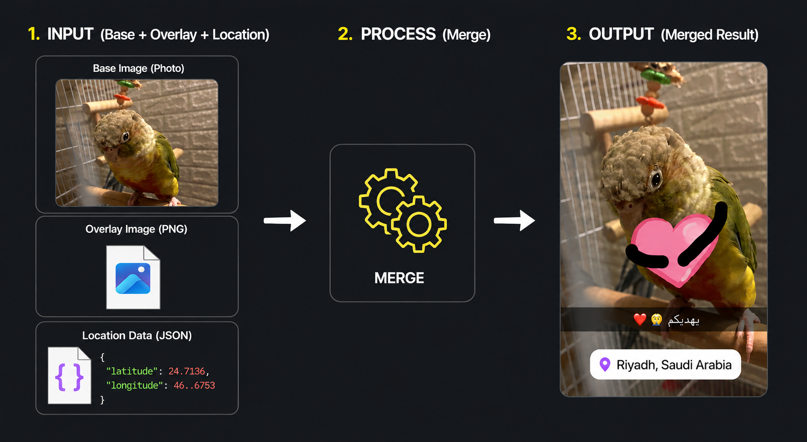
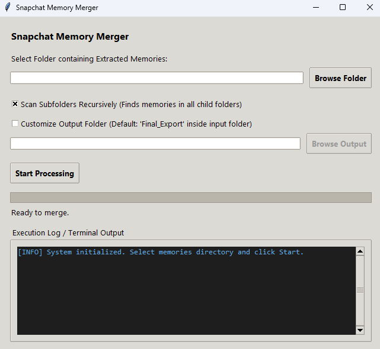

<div align="center">
  <h1>📸 SnapMemoryMerger</h1>
  <p><i>The ultimate tool to revive your Snapchat export data. Merge overlays, restore timestamps, and inject GPS locations with a beautiful GUI!</i></p>

  [-brightgreen?style=for-the-badge&logo=windows)](https://github.com/Al-fozan/SnapMemoryMerger/releases/latest/download/SnapMemoryMerger-v1.0-Windows.zip)
  [](https://www.python.org/)
</div>

<hr>

When you export your Snapchat data, memories often come in broken pairs: a base file and a transparent overlay. **SnapMemoryMerger** is a desktop GUI application built in Python that automatically matches and merges these pairs back into single photos and videos. It also restores their original creation/modification timestamps and intelligently injects GPS metadata using your `memories_history.json`.

<p align="center">
  
</p>

---

## ✨ Key Features

- 🖼️ **Overlay Merging:** Seamlessly combines base photos (using `Pillow`) and videos (using `FFmpeg`) with their transparent overlays.
- 📍 **GPS Location Injection:** Analyzes `memories_history.json` with timezone-aware logic to inject precise GPS metadata into EXIF/MP4 headers.
- ⏱️ **Metadata Preservation:** Retains the original creation and modification timestamps using Windows file APIs (`pywin32`), so your memories stay perfectly sorted in your camera roll.
- 📂 **Recursive Scanning:** Batch process multiple Snapchat export folders and nested directories all at once.
- 🧠 **Smart Directory Memory:** Remembers your previously selected input, output, and JSON directories for faster workflows.
- 💻 **Modern GUI:** Clean, dark-mode desktop interface with real-time log tracking and progress bars.

<p align="center">
  
</p>

---

## 🚀 Quick Start (No Python Required)

For Windows users who want to use the app immediately without installing Python or any dependencies:

1. **[Download the Latest Release](https://github.com/Al-fozan/SnapMemoryMerger/releases/latest/download/SnapMemoryMerger-v1.0-Windows.zip)**
2. Extract the ZIP file.
3. Run `SnapMerger.exe`. 
   > *Note: FFmpeg is already bundled with the executable!*

---

## 🛠️ Installation & Usage (From Source)

If you're on macOS/Linux, or prefer running the script directly from source:

### 1. Prerequisites

- **Python 3.8+**
- **FFmpeg:** Required for video processing.
  - **Windows:** `winget install ffmpeg` *(Restart terminal/IDE after installation)*
  - **macOS:** `brew install ffmpeg`
  - **Linux:** `sudo apt install ffmpeg`

### 2. Setup

Clone the repository and install the required Python packages:

```bash
git clone https://github.com/Al-fozan/SnapMemoryMerger.git
cd SnapMemoryMerger
pip install -r requirements.txt
```

### 3. Running the App

```bash
python snap_merger.py
```

### 4. How to Use

1. **Select Input Folder:** Point the app to your extracted Snapchat memories folder.
2. **Select Output Folder (Optional):** By default, merged files are saved to a `Final_Export` folder inside your input directory.
3. **Inject GPS (Optional):** Check the box and select your `memories_history.json` file if you want location data embedded.
4. Click **Start Processing** and watch the magic happen in the log!

---

## 📦 Building Standalone Executable (.exe)

Want to compile the application yourself into a portable `.exe`?

1. Ensure requirements are installed:
   ```bash
   pip install -r requirements.txt
   ```
2. Run PyInstaller:
   ```bash
   python -m PyInstaller --noconsole --onefile --name SnapMerger snap_merger.py
   ```
3. Your compiled application will be generated in the `dist/` folder as `SnapMerger.exe`.

---

## ⚠️ Notes & Troubleshooting

- **Large Video Exports:** FFmpeg processing might take some time depending on your CPU speed and the number of videos. 
- **Timezone Offsets:** The tool attempts to auto-detect timezone offsets when parsing the JSON file for location metadata. If some locations fail to match, ensure the timestamps in the filename align reasonably well with the JSON entries.
- **Windows Only Timestamps:** Currently, the strict preservation of Creation Time uses Windows-specific APIs (`win32file`). Running from source on macOS/Linux will merge files properly, but might only retain the modification time.

<div align="center">
  <i>Created with ❤️ to keep memories intact.</i>
</div>
